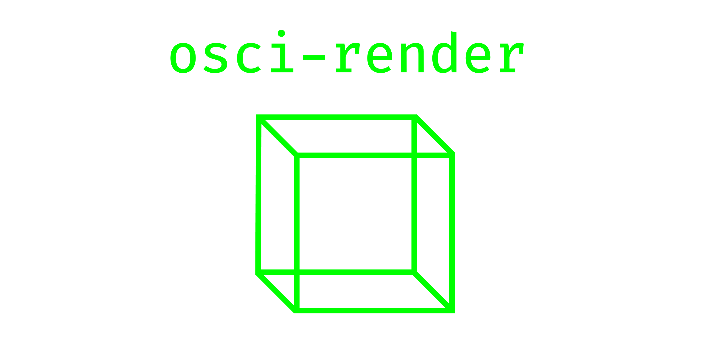
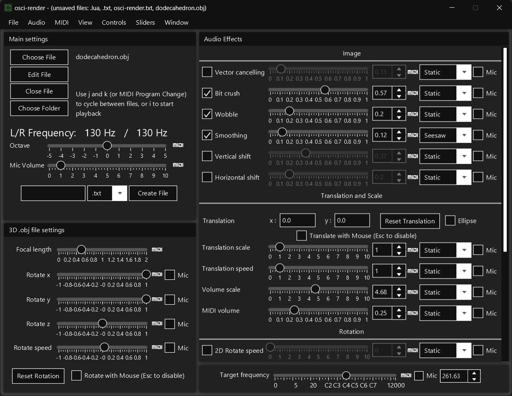

  

Program for making music by drawing objects, text, and images on an oscilloscope using audio output.

This allows for 3D rendering of `.obj` files, `.svg` images, and `.txt` files on Windows, macOS, and Linux.

You can use MIDI to interface with osci-render to make and record music.

Read more about '[Rendering shapes through audio signals](https://felixonline.co.uk/issue/1773/science/rendering-shapes-through-audio-signals)' in this article featuring osci-render!

Send an email to [james@ball.sh](mailto:james@ball.sh) if you have any issues, feedback, feature requests, or anything else!

### Video Demonstration

## Current Features

- Render `.obj` files on an oscilloscope
- Render `.svg` files
- Render text
- Rotation of objects
- Scaling images
- Translating images
- Applying image effects
  - Bit Crush
  - Vertical/Horizontal Distortion
  - Image Wobble
  - Smoothing
  - Image Tracing
- Save rendered audio to .wav file
- Show current frequency of audio
- MIDI control!
- Frequency control

## Proposed Features

- Support rendering of multiple objects
- (long term) Keyframing/animating objects and camera

## Screenshots

## Usage

Using osci-render is very easy; run the program and choose the file you would like to render, and it will output as audio to visualise on your oscilloscope.

By default, the program loads the example cube object. If this is working, you're good to go and should be able to load your own objects, files, or images!

Control the output using the sliders and text boxes provided. Currently the following can be controlled:

- Translation and speed of translation of the output
- Weight of the lines drawn
- Rotation speed
- Scale of the image

There are some additional controls for `.obj` files:

- Focal length of camera
- Position of camera
- Rotation speed
- Rotation direction

Additional effects can be applied to the image such as:

- Vector cancelling (every other audio sample is inverted)
- Bit crush
- Horizontal/Vertical distortion
- Image Wobble (plays sin wave at same frequency as output)
- Smoothing
- Image Trace (traces out the image, drawing only a portion of the whole image)

### MIDI

You can use MIDI to control the frequency of the output - just plug in or open a MIDI software/hardware device and open osci-render and start playing notes!

To control the sliders using a MIDI slider or knob from a physical device, do the following:

- First, plug-in MIDI device
- Open osci-render
- Click MIDI logo next to the slider you want to control
- Red means the slider is 'armed' and waiting for you to choose a MIDI key to associate it with
- Move a CC slider/knob etc. on your MIDI device
- The MIDI logo now turns green, and is controlled by your MIDI device!

## Running

Head over to [Releases](https://github.com/jameshball/osci-render/releases) and download the latest `.exe`, `.deb`, or `.jar`.

`.exe` or `.deb` is recommended, if possible, as it is simpler to get up and running.

### Running using .exe

- Download the latest `osci-render-VERSION.exe` from [Releases](https://github.com/jameshball/osci-render/releases)
- Open the `.exe` skipping any Windows security warnings
- It should open briefly and then close without any user input
- Check your start menu for `osci-render` or open `osci-render.exe` at `C:\Program Files\osci-render`
- Start rendering!

Updating to later versions is as simple as running the latest `osci-render-VERSION.exe` again.

To uninstall, use Windows control panel, as you would expect.

### Running using .deb

- Download the latest `osci-render_VERSION-1_amd64.deb` from [Releases](https://github.com/jameshball/osci-render/releases)
- Install as usual, according to your distro
  - e.g. on Ubuntu, just double click to open and choose software installer
- After installing, you can execute `/opt/osci-render/bin/osci-render` to run!
- Start rendering!

### Running using .jar

- Download the latest `osci-render-os-VERSION.jar` from [Releases](https://github.com/jameshball/osci-render/releases)
  - Download the version that is relevant to your OS, otherwise the program will not open
  - i.e. `osci-render-win-VERSION.jar` for Windows and `osci-render-unix-VERSION.jar` for Linux
- Download and install [Java 17 or later](https://www.oracle.com/java/technologies/downloads/)
- Run the following command from your terminal to run the `.jar`, substituting the correct path to your `.jar` file 
- `java "-Dfile.encoding=UTF8" -jar "PATH/TO/osci-render-os-VERSION.jar"`
- Start rendering!

## Building

I am using Maven for dependency management and to package the program. Doing the following will setup the project. I highly recommend using IntelliJ.

- Download and install [Java 17 or later](https://www.oracle.com/java/technologies/downloads/)
- Run `git clone git@github.com:jameshball/osci-render.git`
- Open the project in IntelliJ
- You're good to go!

You should now be able to run `sh.ball.gui.Launcher` and start the program 😊

## Contact

James Ball, [james@ball.sh](mailto:james@ball.sh)

## Special Thanks

'Rendering shapes through audio signals' article author: [Sudarshan Sreeram](https://github.com/Sudarshan-Sreeram)
