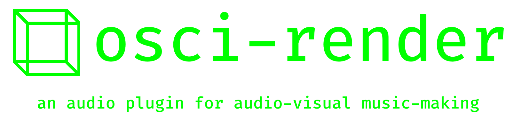
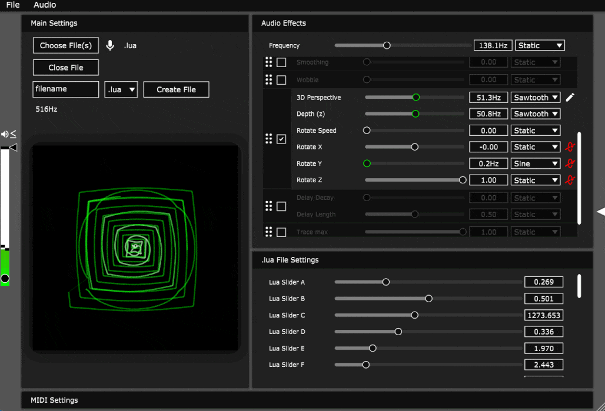
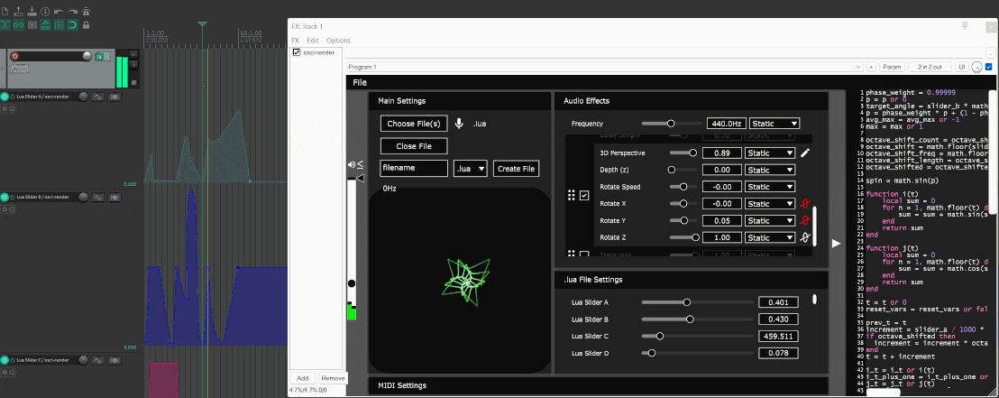
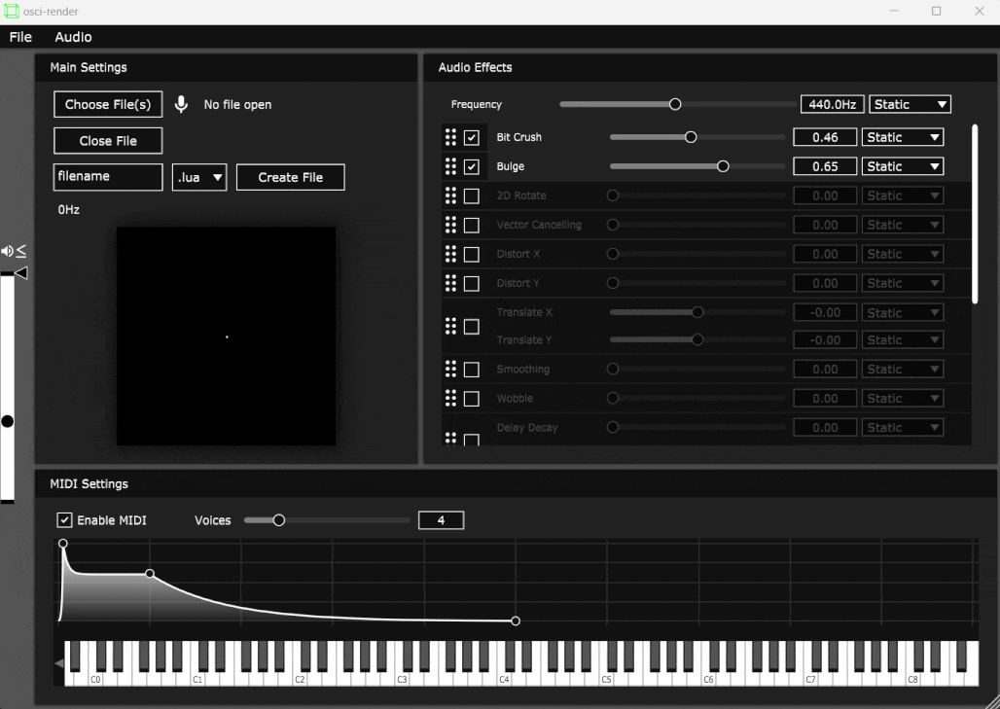
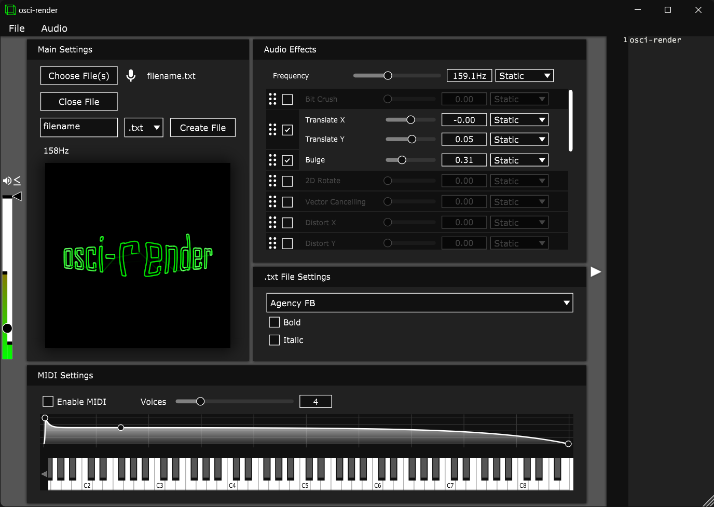
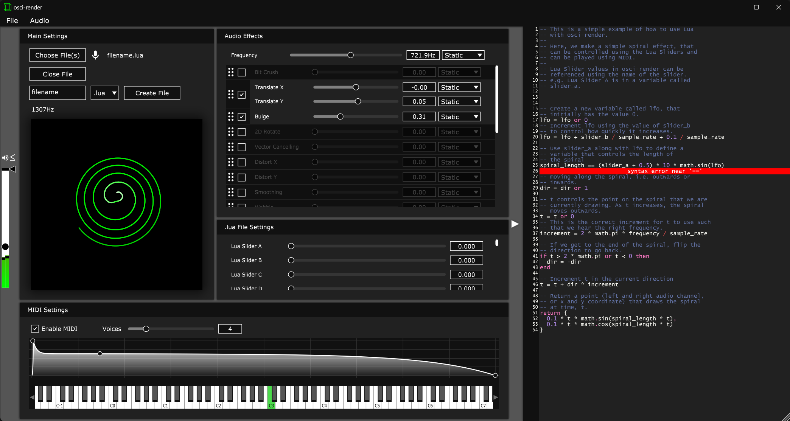
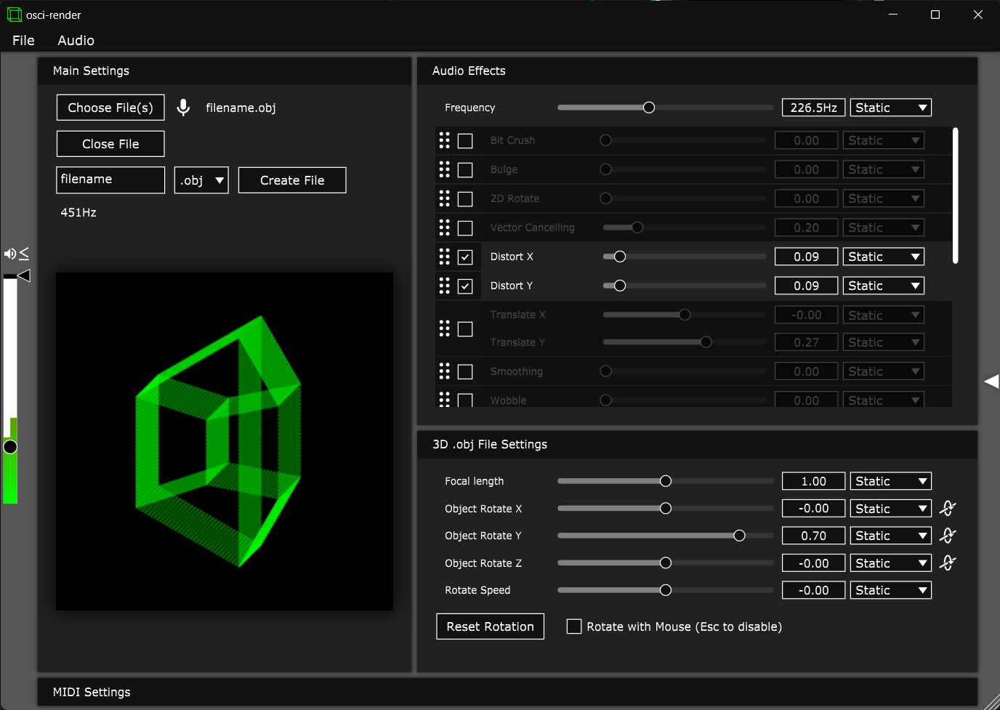
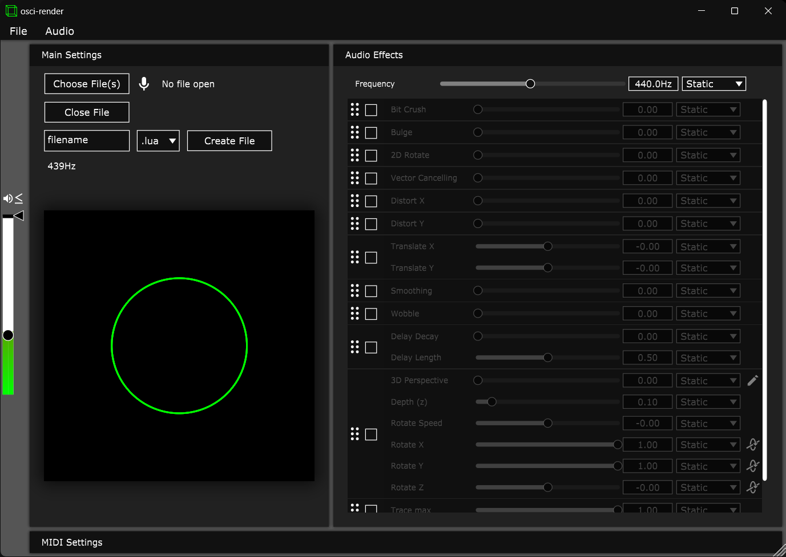
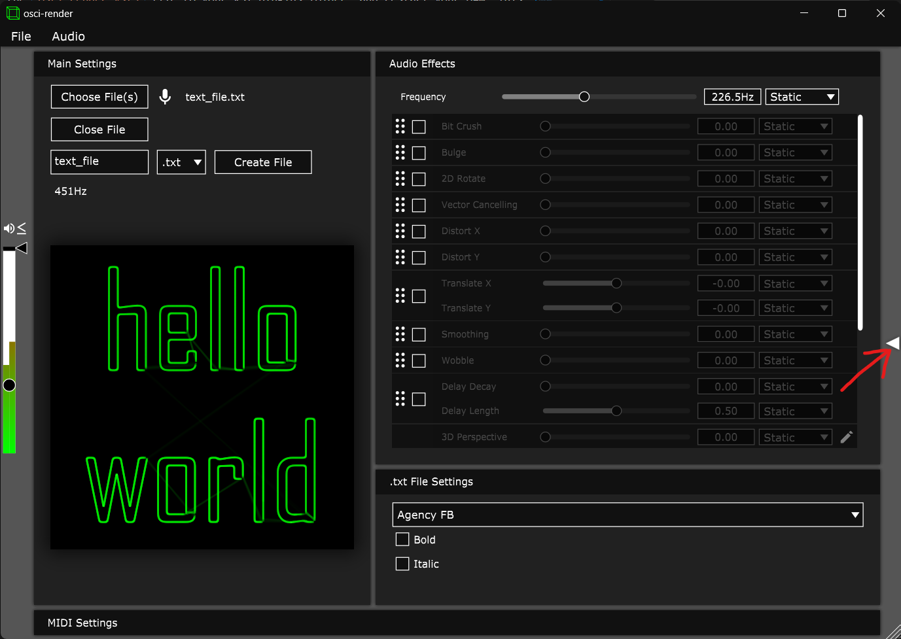
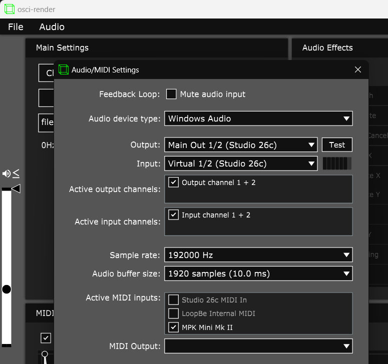

    
  

Open-source synthesizer for making music by drawing objects, text, and images on an oscilloscope using audio. Allows for 3D rendering of `.obj` files, `.svg` images, `.txt` files, and Blender scenes on Windows, macOS, and Linux.

Everything is controllable from a Digital Audio Workstation (DAW), allowing for parameter automation and MIDI control. If you prefer to use osci-render as a standalone application, you can do that too!

Osci-render is a fully programmable synthesiser, allowing for custom visuals, sounds, and audio effects to be scripted using Lua, and interacted with using your DAW.

Get the latest version [here](https://osci-render.com)!

Send an email to [james@ball.sh](mailto:james@ball.sh) if you have any issues, feedback, feature requests, or anything else!

  
  <a href="https://www.youtube.com/watch?v=qQIYtuoDx3w">
Announcing osci-render 2.0 - an audio plugin for oscilloscope music
</a>

## See it in action

### Rendering an animated Blender scene

### Applying audio effects to a Lua script

Project file used to create the above demo: [square_spiral.osci](projects/square_spiral.osci)

### Automating parameters from a DAW

Reaper project used to create the above demo: [square_spiral.rpp](projects/square_spiral.rpp)

### Playing a MIDI keyboard and changing envelope parameters

## Current Features

- Render 3D objects
- Render SVG vector images
- Render text
- Scriptable visuals and audio effects using Lua
- Blender integration
- Software oscilloscope
- Applying image effects
  - Bit Crush
  - Vertical/Horizontal Distortion
  - Image Wobble
  - Image Smoothing
  - Image Tracing
  - ... and more!
- MIDI control
- Automate parameters from a DAW
- Saving and loading projects

## Screenshots

## Download

Download the free version or purchase osci-render premium from the official website: [osci-render.com](https://osci-render.com) to get access to the latest version.

After you've purchased, you'll be sent an email with a download link. Here you can download the latest version for Windows or macOS, as a standalone application or as a VST or AU plugin.

## Installation

### Standalone Application

Run the `osci-render.exe` file on Windows, the `osci-render.app` file on macOS, or `osci-render` executable on Linux. You may need to allow the application to run if you get a warning.

Details on how to bypass security warnings or 'app is damaged' warnings on macOS can be found [here](https://support.apple.com/en-us/HT202491).

### VST Plugin

Copy the `osci-render.vst3` file to your VST plugins folder, and restart your DAW. This is usually located at: `C:\Program Files\Common Files\VST3` on Windows, or `/Library/Audio/Plug-Ins/VST3` on macOS.

### AudioUnit (AU) Plugin

Copy the `osci-render.component` file to your AU plugins folder, and restart your DAW. This is usually located at: `/Library/Audio/Plug-Ins/Components` on macOS.

## Getting Started

Run the application, or add the plugin to your DAW. You should see the below interface, and hear a sine wave playing, and a circle being drawn on the software oscilloscope.

Now you can start opening `.obj` files, `.svg` files, or `.txt` files using the Choose File button, or creating your own files from a set of examples by specifying the file type, and using the Create File button.

To start editing the file you've opened, click the arrow button on the very right of the interface to open the code editor:

Here you can edit the file, and see the changes in real-time. You can also edit the code while the file is playing, and the changes will be applied immediately.

Now, you can start applying audio effects to the image by enabling the effects you want to use in the Audio Effects section of the interface. You can rearrange the order of the effects by dragging them up and down, and animate the parameters using the drop-down menus next to each effect.

You can change the allowed range of each effect by right-clicking on the effect name, and changing the minimum and maximum values. This will change the range the parameter is animated over, and the range of the parameter when being controlled from a DAW.

### Rendering a Blender scene

This [video](https://www.youtube.com/watch?v=pCn297Ejvlw) explains how to install and use osci-render with Blender. Please note that the video is made for osci-render 1.0, so the interface will look slightly different, but the process is the same.

- Download the Blender add-on from [Releases](https://github.com/jameshball/osci-render/releases) named `osci-render-blender-addon.zip`
- [Install and enable the add-on](https://docs.blender.org/manual/en/latest/editors/preferences/addons.html#installing-add-ons) in Blender
- 'osci-render settings' menu will now appear under 'Render Properties'
- Open osci-render
- Click 'Connect to osci-render'
  - If the filename in osci-render changes to 'Rendering from Blender' you have successfully connected
- Add a camera to the scene (if not already present)
- Add a Scene Line Art object to the scene
  - Press Shift+A and navigate to Grease Pencil > Scene Line Art
- Go to 'Modifier Properties' of the newly created Line Art object
- Click 'Bake Line Art' under the the 'Bake' settings to generate line art for the current animation/scene/camera
- You should now see the scene on the oscilloscope!

### MIDI

To enable MIDI control, open the MIDI settings at the bottom of the interface, and click 'Enable MIDI'.

Make sure your MIDI device is enabled by clicking Audio > Settings from the top menu, and enabling your MIDI device under Active MIDI inputs:

## Building

### Windows

TODO

### macOS

TODO

### Linux

- Clone osci-render
- Install required packages
  - `sudo apt update`
  - `sudo apt install libasound2-dev libjack-jackd2-dev ladspa-sdk libcurl4-openssl-dev libfreetype6-dev libx11-dev libxcomposite-dev libxcursor-dev libxcursor-dev libxext-dev libxinerama-dev libxrandr-dev libxrender-dev libwebkit2gtk-4.0-dev libglu1-mesa-dev mesa-common-dev g++ make`
- Download JUCE from here https://juce.com/download/
- Unzip the file
- Run `Projucer` from where you unzipped: `./JUCE/Projucer`
- Open `osci-render.jucer` in Projucer
- Go to File > Save Project to create a Makefile
- Go to the `LinuxMakefile` folder: `cd osci-render/Builds/LinuxMakefile`
- Build the project: `make CONFIG=Release` for release, or `make CONFIG=Debug` for testing
- Go to the build folder: `cd build`
- Run `osci-render` executable, or use the VST3 file

## Contact

James H Ball, [james@ball.sh](mailto:james@ball.sh)

## License

The source code in this repository is licensed under the GNU General Public License v3.0 (see [LICENSE](LICENSE)). All image assets in the repository (including files under `images/`, `Resources/`, `External/Resources`, and any other artwork) are copyright © James H Ball and/or their respective creators. These images are provided only for documentation, demonstration, and build purposes and are **not** licensed under GPLv3 or any other open-source license. Please obtain written permission before reusing, redistributing, or creating derivative works from these images. See [IMAGE_LICENSE.md](IMAGE_LICENSE.md) for details.
