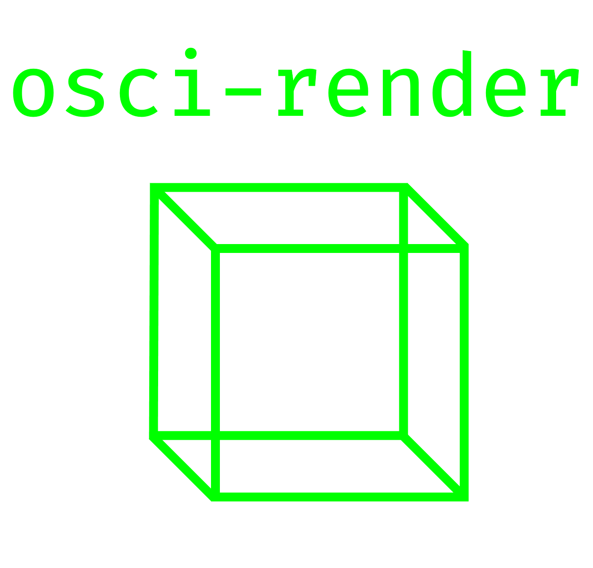

  

Program for making music by drawing objects, text, and images on an oscilloscope using audio output.

This allows for 3D rendering of `.obj` files, `.svg` images, `.txt` files, and Blender scenes on Windows, macOS, and Linux.

You can use MIDI to interface with osci-render to make and record music.

Read more about '[Rendering shapes through audio signals](https://felixonline.co.uk/issue/1773/science/rendering-shapes-through-audio-signals)' in this article featuring osci-render!

Send an email to [james@ball.sh](mailto:james@ball.sh) if you have any issues, feedback, feature requests, or anything else!

### Video Demonstrations

#### Full overview

[youtube.com/watch?v=PKVCx7rs_r8](https://www.youtube.com/watch?v=PKVCx7rs_r8)

#### Getting started

[youtube.com/watch?v=ZeP-0U8ebKU](https://www.youtube.com/watch?v=ZeP-0U8ebKU)

## Current Features

- Render `.obj` files on an oscilloscope
- Render `.svg` files
- Render text
- [Blender integration](https://www.youtube.com/watch?v=pCn297Ejvlw)
- [Software oscilloscope visualisation](https://james.ball.sh/oscilloscope)
- Rotation of objects
- Scaling images
- Translating images
- Applying image effects
  - Bit Crush
  - Vertical/Horizontal Distortion
  - Image Wobble
  - Smoothing
  - Image Tracing
- Save rendered audio to .wav file
- Show current frequency of audio
- MIDI control!
- Frequency control
- Animating image effects

## Screenshots

## Usage

Using osci-render is very easy; run the program and choose the file you would like to render, and it will output as audio to visualise on your oscilloscope.

By default, the program loads the example cube object. If this is working, you're good to go and should be able to load your own objects, files, or images!

Control the output using the sliders and text boxes provided. Currently the following can be controlled:

- Translation and speed of translation
- Weight of the lines drawn
- Rotation speed
- Volume/scale of the image
- Frequency

There are some additional controls for `.obj` files:

- Focal length of camera
- Rotation speed
- Rotation direction

Additional effects can be applied to the image such as:

- Vector cancelling (every other audio sample is inverted)
- Bit crush
- Horizontal/Vertical distortion
- Image Wobble (plays sin wave at same frequency as output)
- Smoothing
- Image Trace (traces out the image, drawing only a portion of the whole image)

### Using osci-render with Blender

This [video](https://www.youtube.com/watch?v=pCn297Ejvlw) explains how to install and use osci-render with Blender. Below is an overview of the process, assuming you've already [installed osci-render](#installing).

- Download the latest Blender add-on from [Releases](https://github.com/jameshball/osci-render/releases) named `osci-render-blender-addon.zip`
- [Install and enable the add-on](https://docs.blender.org/manual/en/latest/editors/preferences/addons.html#installing-add-ons) in Blender
- 'osci-render settings' menu will now appear under 'Render Properties'
- Open osci-render
- Click 'Connect to osci-render'
  - If the filename in osci-render changes to 'Rendering from external input' you have successfully connected
- Add a camera to the scene (if not already present)
- Add a Scene Line Art object to the scene
  - Press Shift+A and navigate to Grease Pencil > Scene Line Art
- Go to 'Modifier Properties' of the newly created Line Art object
- Click 'Bake Line Art' under the the 'Bake' settings to generate line art for the current animation/scene/camera
- You should now see the scene on your oscilloscope!

If there are any problems, please create an [issue](https://github.com/jameshball/osci-render/issues)!

### Using osci-render without an oscilloscope

osci-render now has a software oscilloscope built-in! It is a modified version of [m1el/woscope](https://github.com/m1el/woscope), an amazing web-based software oscilloscope.

You can open it from Window > Open Software Oscilloscope which will open [james.ball.sh/oscilloscope](https://james.ball.sh/oscilloscope) in your default browser.

If there are any problems, please create an [issue](https://github.com/jameshball/osci-render/issues)!

### MIDI

You can use MIDI to control the frequency of the output - just plug in or open a MIDI software/hardware device and open osci-render and start playing notes!

To control the sliders using a MIDI slider or knob from a physical device, do the following:

- First, plug-in MIDI device
- Open osci-render
- Click MIDI logo next to the slider you want to control
- Red means the slider is 'armed' and waiting for you to choose a MIDI key to associate it with
- Move a CC slider/knob etc. on your MIDI device
- The MIDI logo now turns green, and is controlled by your MIDI device!

## Installing

Head over to [Releases](https://github.com/jameshball/osci-render/releases) and download the latest `.exe`, `.pkg`, `.deb`, or `.jar`.

`.exe`, `.pkg`, or `.deb` is recommended, if possible, as it is simpler to get up and running.

### Installing using .exe (Windows)

- Download the latest `osci-render-VERSION.exe` from [Releases](https://github.com/jameshball/osci-render/releases)
- Open the `.exe` skipping any Windows security warnings
- It should open briefly and then close without any user input
- Check your start menu for `osci-render` or open `osci-render.exe` at `C:\Program Files\osci-render`
- Start rendering!

Updating to later versions is as simple as running the latest `osci-render-VERSION.exe` again.

To uninstall, use Windows control panel, as you would expect.

### Installing using .pkg (macOS)

- Download the latest `osci-render-VERSION.pkg` from [Releases](https://github.com/jameshball/osci-render/releases)
- Since I haven't paid for a developer licence, you'll be warned that it is from an 'unidentified developer' when trying to run the installer
- To mitigate this, do the following (explained on the [macOS User Guide](https://support.apple.com/en-gb/guide/mac-help/mh40616/mac))
  - Locate the downloaded `.pkg` file in Finder
  - Control-click the file, and choose Open from the shortcut menu
  - Click Open
- Follow the steps in the installer
- Open `osci-render` from the Launchpad
- Start rendering!

### Installing using .deb (Ubuntu)

- Download the latest `osci-render_VERSION-1_amd64.deb` from [Releases](https://github.com/jameshball/osci-render/releases)
- Install as usual, according to your distro
  - e.g. on Ubuntu, just double click to open and choose software installer
- After installing, you can execute `/opt/osci-render/bin/osci-render` to run!
- Start rendering!

### Running using .jar (all platforms)

- Download the latest `osci-render-os-VERSION.jar` from [Releases](https://github.com/jameshball/osci-render/releases)
  - Download the version that is relevant to your OS, otherwise the program will not open
  - i.e. `osci-render-win-VERSION.jar` for Windows and `osci-render-unix-VERSION.jar` for Linux
- Download and install [Java 17 or later](https://www.oracle.com/java/technologies/downloads/)
- Run the following command from your terminal to run the `.jar`, substituting the correct path to your `.jar` file 
- `java "-Dfile.encoding=UTF8" -jar "PATH/TO/osci-render-os-VERSION.jar"`
- Start rendering!

## Building

I am using Maven for dependency management and to package the program. Doing the following will setup the project. I highly recommend using IntelliJ.

- Download and install [Java 17 or later](https://www.oracle.com/java/technologies/downloads/)
- Run `git clone git@github.com:jameshball/osci-render.git`
- Open the project in IntelliJ
- I use [SceneBuilder](https://gluonhq.com/products/scene-builder/) to edit the GUI
  - The FXML project files for each GUI element are located in `src/main/resources/fxml`
- You're good to go!

You should now be able to run `sh.ball.gui.Launcher` and start the program 😊

## Contact

James Ball, [james@ball.sh](mailto:james@ball.sh)

## Special Thanks

'Rendering shapes through audio signals' article author: [Sudarshan Sreeram](https://github.com/Sudarshan-Sreeram)

[@javierplano_videonix](https://www.instagram.com/javierplano_videonix/) for testing and providing advice as an artist
